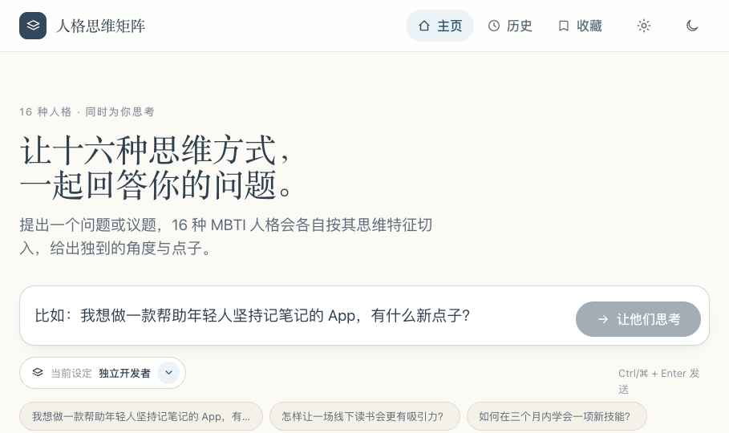

# MBTI Persona Agent UI

[中文说明](./README.zh-CN.md)

A local-first web app that turns the 16 MBTI types into distinct thinking agents. Ask one question, optionally add your own background settings, and the app will let every personality respond with its own tone, decision style, conclusion, ideas, and follow-up context.



## What It Does

- Generates 16 differentiated MBTI responses for the same question.
- Gives every type a separate voice, decision preference, blind spot, objection style, conclusion, ideas, and tags.
- Supports multi-round conversations: summarize a round, ask follow-up questions, and keep previous rounds available.
- Adds a Reddit research mode that fetches real posts before the personas reason over the problem.
- Uses a model-first research strategy: the configured LLM translates a Chinese or English question into search queries, target communities, audience, domain, and keywords.
- Falls back to a Chinese-English research lexicon when no model is configured or the strategy call fails.
- Lets you save custom presets for your own background, domain, and preferred output style.
- Stores presets, history, favorites, and API configuration in the browser's local storage.

## Stack

- Plain React through browser-loaded Babel.
- Node.js local server for static files, model proxying, and Reddit RSS search.
- No database and no build step.

## Quick Start

```bash
npm start
```

Open:

```text
http://127.0.0.1:4174/
```

Run the syntax check:

```bash
npm run check
```

Node.js 18 or newer is required.

## Model API Setup

Open the app, click the settings button, and configure a provider:

- OpenAI or OpenAI-compatible Chat Completions
- DeepSeek
- Anthropic Claude
- Google Gemini
- OpenRouter
- Custom OpenAI-compatible endpoint

The DeepSeek template is included, and the model ID can be edited in the settings panel to match the model available in your account.

API keys are not written to files by the app. They are stored in browser local storage and sent to the local Node server only when you make a model request. For a public deployment, add your own server-side secret management before exposing the app to other users.

## Reddit Research Mode

The research workflow has three modes:

- Focused mode: searches SideProject, startups, Entrepreneur, SaaS, and indiehackers.
- Global discovery mode: discovers relevant communities first, then deepens the search.
- Custom mode: lets you enter specific subreddits such as `smallbusiness`, `freelance`, `teachers`, `ADHD`, or `realestate`.

When a model API is configured, the app first asks the model to produce a structured search strategy. When the model is unavailable, the server uses its built-in Chinese-English lexicon and rule-based query expansion.

## Project Structure

```text
.
├── App.jsx          # Main app shell, ask flow, round switching, research UI
├── PersonaCard.jsx  # MBTI result card rendering
├── data.js          # Personality data and preset metadata
├── llm.js           # Provider calls, prompt builders, demo fallback
├── server.js        # Local server, proxy, Reddit research endpoint
├── store.jsx        # Local storage, toast host, app state helpers
├── views.jsx        # Settings, history, favorites, preset modal
├── styles.css       # Main page styling
├── cards.css        # Persona card styling
└── screenshots/     # Preview screenshots
```

## Notes

This project is a prototype for exploring multi-perspective ideation. MBTI labels are used as product interaction roles, not as scientific personality assessment results.

